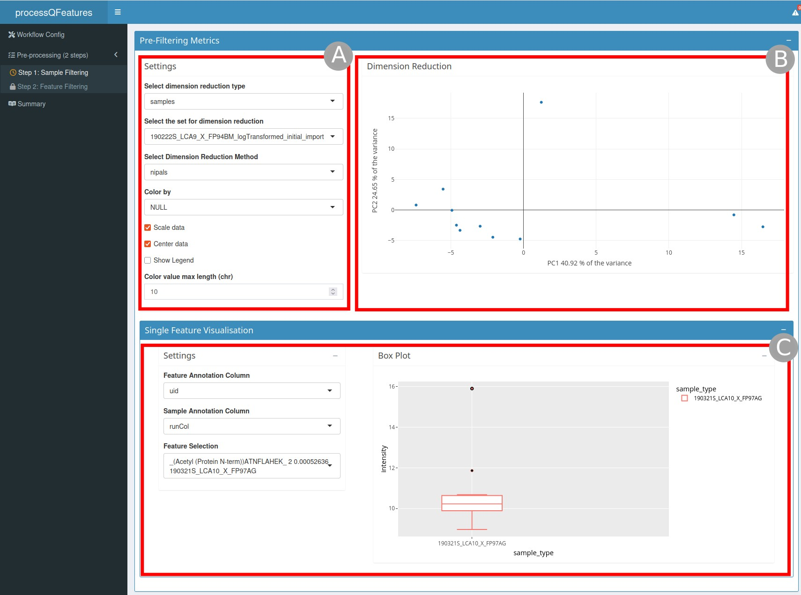
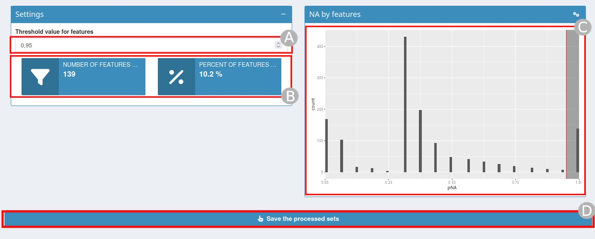
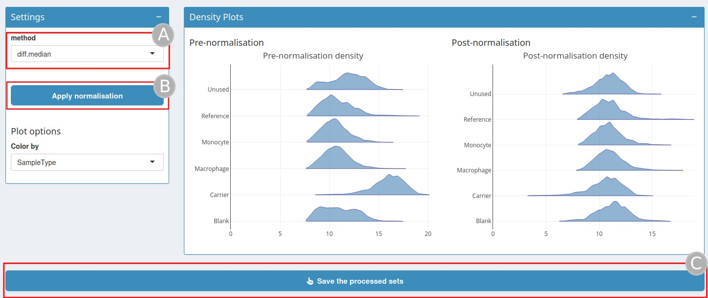
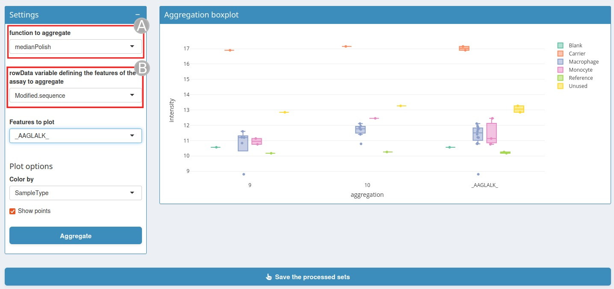

```{r, include = FALSE}
knitr::opts_chunk$set(
    collapse = TRUE,
    comment = "#>",
    crop = NULL
)
```


# Start the app

Parameters of the shiny application : 

- `qfeatures`: a QFeatures object this can be either  a path to an rds file or a 
QFeatures object already loaded in your R session.

- `prefilledSteps`(optional): define the different steps of the workflow use to
analyze the QFeatures object, accepted values are `'sampleFiltering'`, `'featureFiltering'`, `'normalisation'`, `'missingValuesFeatures'`, `'missingValuesSamples'`, `'aggregation'`
and `'join'`. The suggested workflow set as default value is `sampleFiltering`, 
`featureFiltering`, `missingValuesFeatures`, `missingValuesSamples`, `normalisation`,
`aggregation`, `join` and `aggregation`.

- `initialSets`(optional): Sets to use for the analysis of the QFeatures object.
Default is set to `seq_along(qfeatures)`.


# Workflow configuration

A predefined workflow is set by default with the argument `prefilledSteps`, if 
`prefilledSteps` has been change when launching the application this will be take
in account. 

On the page there is a brief explanation of what each step is doing. If you want to change the workflow you can drag and drop the different steps that you want to execute on the QFeatures object. 
Once the workflow is configurate you can click on `Confirm Current Workflow`.

If the default workflow is the workflow you want to use or if you already passed the workflow you want to use in `prefilledSteps` parameters you can just click on `Step 1`.

# Sample/Feature Filtering

## Pre-Filtering Metrics section

```{r, echo = FALSE, out.width="100%", fig.cap= "pre-Filtering metrics section"}

```

`pre-Filtering metrics` section (Figure 1) is composed of two different part : 
  
  - a dimension reduction graph (`B`) on the right and the settings (`A`) to customize this graph on the left, you can for example choose the method of dimension reduction or the type of dimension reduction.
  
  - a single feature visualization (`C`) where you can show a boxplot of a feature selected split by sample annotation.

## Filtering section

```{r, echo = FALSE, out.width="100%", fig.cap= "filtering section"}
knitr::include_graphics("screenshots/filtering.jpg")
```

- the second one is the `Filtering` section (Figure 2), to create a condition can click on 
`Add Filtering Condition` (`A`), a click on this button will open the `filtering boxes` (`B`) in this box you can add some filtering condition once you have chosen the annotation and the value to filter you can see dynamically how many cells will filtered out. You can find a summary of the conditions you chose, once the filters are chosen you can click on `Apply Filters` (`C`). If one condition is unneeded you can also click on the button `Remove last condition` (`A`). 

## Post-filtering Metrics section

```{r, echo = FALSE, out.width="100%", fig.cap= "post-Filtering metrics section"}
knitr::include_graphics("screenshots/postFilteringMetrics.jpg")
```

- the third section is the `post-Filtering metrics` (Figure 3), this box is composed of the same element as the `pre-Filtering metrics` section but the graph contains data post filtering. It also contains some statistics on the number/percent of samples/features removed. 

Once the filtering has been done you can save by using the button `Save the processed sets`.

# Filtering missing values by samples/features

```{r, echo = FALSE, out.width="100%", fig.cap= "post-Filtering metrics section"}

```

Missing values can be very numerous in certain proteomics experiments and need to be dealt with carefully.

In this step you will have to define a threshold value for the percent of NA above what a feature/sample should be discard (`A`). By changing this value, the statistics of the number and percent of features/samples removed (`B`) and the associated plot (`C`) will automatically be updated. Once the threshold has been set type on `Save the processed sets` (`D`).

# Normalisation

```{r, echo = FALSE, out.width="100%", fig.cap= "post-Filtering metrics section"}

```

QFeatures object can be normalised on this step. The user can choose between different type of normalisation method (`A`). 

- `sum` and `max`, where each feature's intensity is divided by the maximum or the sum of the feature respectively. These two methods are applied along the features (rows).

- `center.mean` and `center.median` center the respective sample (column) intensities by substracting the respective column means or medians. `div.mean` and `div.median` divide by the column means or medians.

- `diff.median` center all samples (columns) so that they all match the grand medianby substracting the respective columns medians differences to the grand median.

- Using `quantiles` or `quantiles.robust` applies (robust) quantile normalisation, as implemented in `preprocessCore::normalize.quantiles()` and `preprocessCore::normalize.quantiles.robust()`. `vsn` uses `vsn::vsn2()` function. Note that the latter also glog-transforms the intensities. See respective manuals for more details and functions arguments.

Once the normalisation method is selected you can click on `Apply normalisation` (`B`), this will display the post normalisation density plot. Once this is done click on `Save the processed sets` (`C`). 

# Aggregation

```{r, echo = FALSE, out.width="100%", fig.cap= "post-Filtering metrics section"}

```

At this stage, it is possible to use the peptide-level intensities or aggregate the peptide-level data into protein intensities. 

To perform this step a function used for quantitative feature aggregation is needed using `function to aggregate` (`A`). This function takes a matrix as input and returns a vector of length equal to `ncol(x)`. Functions can be one of :

- `MsCoreUtils::medianPolish()` to fits an additive model (two way of decomposition) using Tukey's median polish_procedure using `stats::medpolish()`.

- `MsCoreUtils::robustSummary` to calculate a robust aggregation using `MASS::rlm()` (default).

- `base::colMeans()` to use the mean of each column.

- `matrixStats::colMedians()` to use the median of each column.

- `base::colSums()` to use the sum of each column.

See `MsCoreUtils::aggregate_by_vector()` for more aggregatiobn functions.

A rowData variable (`B`) is also needed defining how to aggregate the features of the assays.

Once these two variable has been set click on `Aggregate`.

An aggregation boxplot will be display. This boxplot shows a feature color by a value of the colData.

# Join

```{r, echo = FALSE, out.width="100%", fig.cap= "post-Filtering metrics section"}
knitr::include_graphics("screenshots/join.jpg")
```

Join tab will combine the results of previous step into one for downstream analysis or for export, just need a new name (`A`) for the new dataset. Then click on `Join and save the processed sets` (`B`).

# Summary

The summary page return the different assays present in the QFeatures object, it also shows how the different assays are linked with each other. Finally a download button will return a zip file containing the final QFeatures object the script that has been used to generate the QFeatures object and the Rsession with the version of the package.